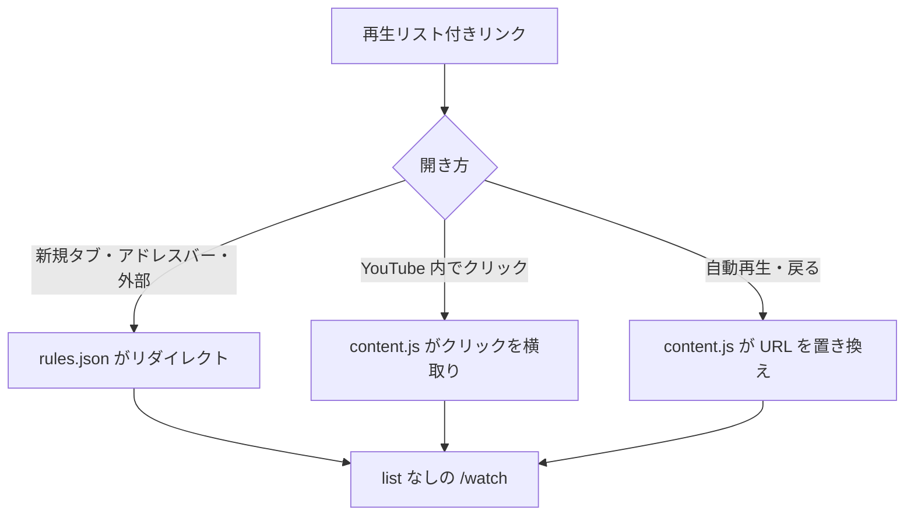

# plis

### play list is shit

**YouTube の動画リンクから再生リストを常に外すブラウザ拡張**

俺の見聞きするものをコントロールする事は許されない

---

## 概要

YouTube で動画を開くと、URL に `list=` が付いて勝手に再生リストやミックスの続きが流れる、なんとおぞましい。plis はこの `list` 系パラメータを常に取り除き、動画を単体で再生させる。あわせて、一覧に出てくるミックスの項目を非表示にする。

## 特徴

| 機能 | 内容 |
| --- | --- |
| URL から再生リストを除去 | `/watch` の `list` / `index` / `start_radio` を外す。`t=` などほかのパラメータは残す |
| ページ読み込み時の除去 | 新規タブ・アドレスバー・外部リンク・`youtu.be` 経由を `declarativeNetRequest` でリダイレクト |
| YouTube 内の遷移にも対応 | 再生リスト付きリンクのクリックを横取りし、除去後の URL で開き直す |
| 自動再生・戻るの保険 | 遷移後の URL に `list` が残っていれば置き換える |
| ミックスを非表示 | `list=RD...` / `start_radio=1` のカードと、再生ページ右側の再生リスト欄を隠す |
| 再生リストページは残す | `/playlist?list=...` はそのまま見られる |

## 処理フロー

## インストール

1. このリポジトリをダウンロードして展開する
2. `chrome://extensions`（Brave は `brave://extensions`）を開き、右上の「デベロッパーモード」をオンにする
3. 「パッケージ化されていない拡張機能を読み込む」で展開したフォルダを選ぶ

## 使い方

入れるだけで動く。設定項目はない。かっこいい。

| ファイル | 役割 |
| --- | --- |
| `manifest.json` | 拡張の定義 |
| `rules.json` | ページ読み込み時のリダイレクト規則 |
| `content.js` | YouTube 内の遷移の処理 |
| `hide-mix.css` | ミックスの非表示 |

YouTube が自動で作る音楽系のリスト（`list=RDCLAK...` など）も ID が `RD` で始まるため、ミックスと同じく非表示になる。

## ライセンス

[MIT](LICENSE)
